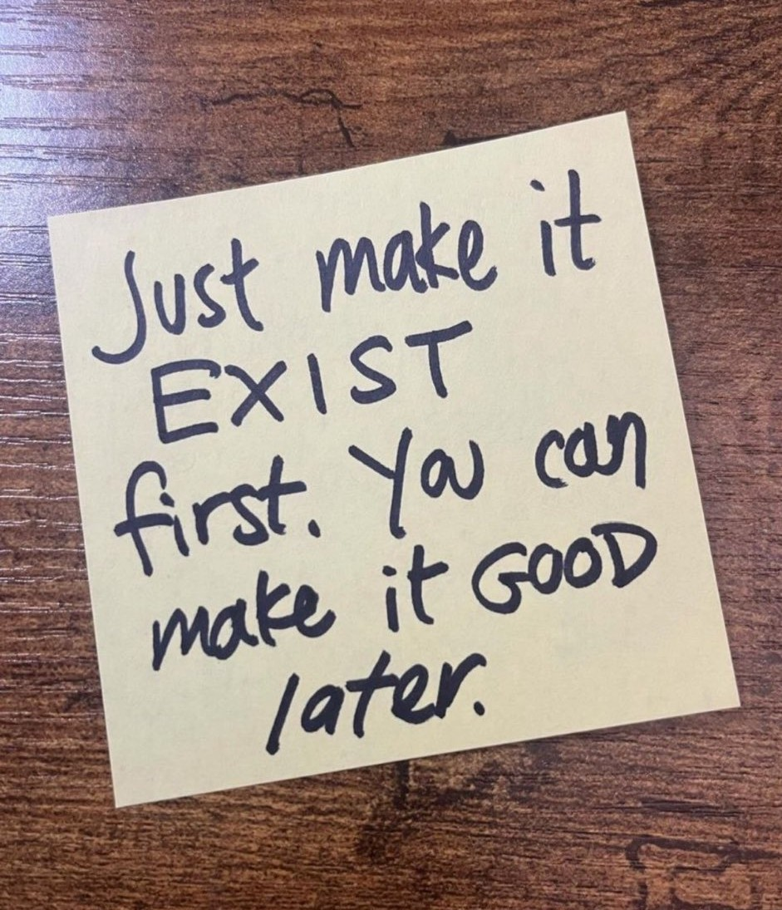
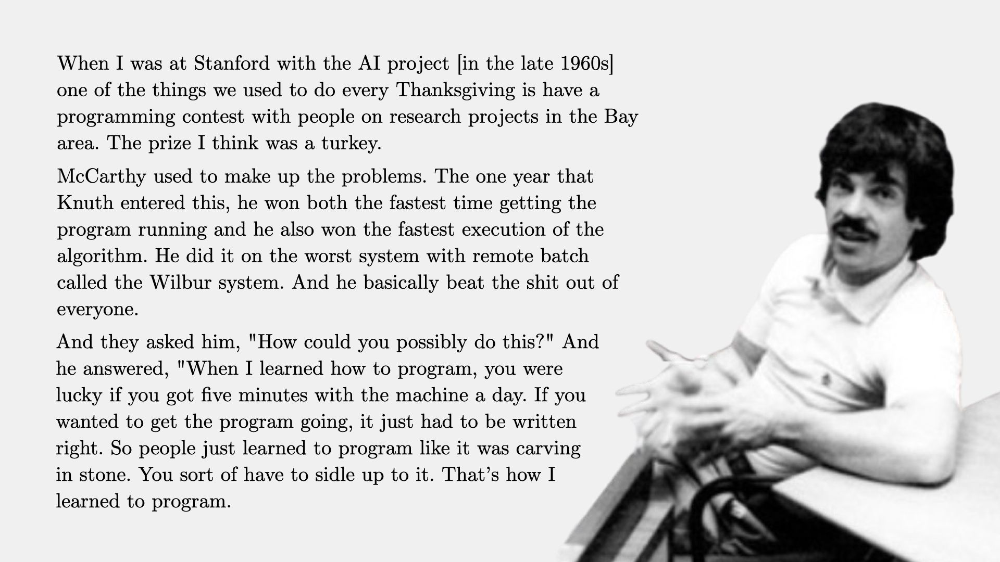

<p align="center">

</p>

## What we learned 

Lots of stuff.   Stuff that gives power and few know.
With working examples on real hardware.

--------------------------------------------------------
### The Raw Material

20k lines of .md files:
```
    ~/class/cs140e-25win % find . -name "*.md" | xargs wc
    20103 125643 828477 total
```


Almost 40k lines of code (".h", ".c", ".S"):
```
    ~/class/cs140e-25win/labs % find . -name "*.[chS]" | xargs wc
    39830  163894 1266670 total
```

--------------------------------------------------------
### The class approach

<p align="center">

</p>

The general class approach:
  - real hardware, not simulator.
  - from raw data sheets and arch manual, not pre-digested
    textbooks.
  - deep checking methods to find bugs.  want to be
    surprised if code breaks.
  - each lab = new interesting artifact.

write small example for each concept.  
 - big step from 0 to 1.  

while small:
 - the code works;
 - and runs on raw hardware.
 - and you wrote the crucial pieces;
 - and you can build out until real.
 - "Show me an example and I'll show you the law"


--------------------------------------------------------
### Data sheets: magick lore

<p align="center">

</p>

Eaten many data sheets:
 - GPIO
 - UART
 - machine exceptions
 - Device interrupts
 - Debug hardware
 - NRF (70+ pages)
 - Virtual memory (100+ pages)
 - Crazy VM coherence rules (I've never
   seen a more IQ intensive 12 pages)
 - the next one you read: NBD.

Data sheets are the hardest thing to understand.  
 - Few can.
 - So few can build interesting hardware. 
 - Or they only work with simplified abstractions and don't
   realize the cool tricks that the lowest level has (e.g.,
   Ch 3 of arm1176).
 - You now have the superpower of being able to 
   transmute "passive definitional" datasheet prose into
   working code, despite errata and subtly brittle rules.  
 - Most other docs are relatively easy.  Try it!
   (E.g., medical journal papers --- its not hard to figure out stuff
   in a few hours that a specialist doesn't know).

--------------------------------------------------------
### Concepts

Execution is main gerund of Turing world, so we exhausted all angles:

 - cooperative thread
 - pre-emptive thread
 - interrupt
 - exception
 - user process
 - kernel
 - single step 

Assembly:
 - context switching (coop, premptive)
 - vm / tlb / invalidation
 - debug hardware assembly
 - interrupt state
 - lots of you went free range and wrote tons of
   assembly for all sorts of things.

You have simple, working versions of main OS nouns:
 - processes
 - vm
 - file system 
 - networking
 - threads
 - small but real: can build out.

--------------------------------------------------------
### Learned: How to check hard code

We did alot of checking to show the code wasn't broken trash. 
Few (or no) other people know these tricks:

 - cross checking memory state:
    - showing device code equivalence by grabbing all device
      loads and stores and hashing to compare (UART, GPIO).
    - "show me your tape, and I'll show you your turing machine"
 - use of simulation (fake-pi) to push code through
   paths hard on real hw.
 - use of linker tricks to intercept loads and stores.
 - use of single step to monitor all instructions + registers.

Single-step equivalance checking:
 - verify that not even a single bit changed in even a single register for
   even a single instruction in code that should not be effected.

   This is exceptionally powerful.  Makes test
   cases for free, and checks deeply.
 - SS-eq check for race conditions by using single step to 
   switch on every instruction and verifying equiv to some
   sequential execution.
 - SS-eq check for OS: showed how to check OS by switching every process
 on every instruction, checking that get same
   execution hash with no VM, with pinned VM, with PT vm, with caching,
   with few process with many process, with optimized code, w unopt, etc.
   If you build out the OS further: I would absolutely use this approach.

Our belief: you can push these methods a point where you are suprised
if hard code is broken.

--------------------------------------------------------
### How to write hard code

<p align="center">

</p>

Even if you don't write another line of OS code, hopefully the lack of
safety net + hard bugs in-grained a much better approach to writing code.
  - NEVER: write 1000 lines, and when you run it and it
    breaks, use the stare method "it doesn't work, why?"

  - ALWAYS: do epsilon-induction
    1. start from working system (verify its working even 
       if you "know for sure" --- easy for something in env 
       to change)
    2. do tiny change
    3. validate working.
    4. if not easy to solve.
    5. if so, go back to (ii).

Generalized: The Epsilon Paradox:
  - "the shorter your step, the faster you can sprint"
  - working system + one line change = easy linear eq solve
    if wrong
  - In contrast debugging a system that breaks after you
    added X, Y, Z --- hard to solve b/c multiplicative.  Is the problem X,
    or Y, or Z, or XY, or XZ, or YZ, or XYZ?  And if you find the right
    combination, why?  Which line(s)?

My belief:
  - yes 10x programmers exist.
  - but it's not necessarily that they are 10x smarter.
  - multiplication of two things:
      1. understand N lines of code better (IQ)
      2. but: able to make delta N smaller (practice)
      3. so: multiply (1) and (2) = 10x
  - IQ is at best fixed, but you can absolutely get better 
    at smaller steps.


Related, common initial class mistake that has been 
largely evaporated by the heat of pain:
  - wrote something, ran it, declare "it works".
  - No.  It worked once with a limited set of tests.
  - Maybe got lucky with timing;
  - or that you had only a few processes;
  - or cache didn't have conflict or alias;
  - or a missing cache invalidation didn't matter b/c 
    that run didn't load the entry;
  - or that code straddled a 16 byte boundary
    so you got lucky with a pipeline stall that hid a timing
    race with the device;  
  - or the compiler didn't coalesce or swap two loads and 
    stores that it was allowed to;
  - or ...

Saying hardware-level code works if it passed a few test cases is on
the level of saying "it compiled, why did it crash".  Hence
why we spent so much time on checking methods.

--------------------------------------------------------
### How to debug hard code

Differential (Ockam) debugging (binary search + reversion):
  - Your system is broken.
  - Spend your time reverting pieces back to working 
    versions, until you get the smallest change that 
    shows the bug.
  - E.g., we gave staff .o's but you can use yesterdays
    working .o's.  you can turn off features. you
    can cut down number of processes, mappings, etc.  
  - "differential debugging" (binary search + reversion).

Differential debugging especially useful for hardware.
  - system that worked yesterday doesn't today.
  - same approach: swap out different pieces to isolate.
  - different pi, different laptop, different 
    person doing the checks.  
  - we did this from lab 1 on.
  - In general, bug probably sw, but 1 out of 20 isn't, so
    the faster you can eliminate or diagnose this 1:20 chance of broken
    hw, the more cycles you have for each software bug.

Trust but verify:
  - use asserts to shrink trust from everything 
    (a belief with no validation that "i don't see how this
    could be wrong") to no trust ("i just verified
    it is not wrong").
  - do this especially if you have an "impossible bug" ---
    likely an assumption somewhere is off.

--------------------------------------------------------
### Thanks for great class!

Largest we've ever had.  Everyone worked incredibly hard.  Lots of wild
results and hardcore projects.  Learning goal saturation.

And thanks to the crazy, cracked pirate crew staff who
often stayed til 2am helping people.
  - Joe: head pirate capt who swabbed the decks at all hours;
  - Ammar, who did it free(!!!) for the love of the game;
  - Arjun + Joseph ("rise of the new gen");
  - Matthew: low key PhD facts.

Crazy workload.  Crazy class :)

A few asks:
 - Aditi setup an alumni discord (see Ed)
 - if you think you aren't ever going to touch your hardware
   please drop it off.  if you might use it, keep it!
 - We're going to have to fight for this room next year
   so let us know if you have interesting bio facts that we can
   use in the argument.
 - Mildly debating doing a "140e II" where we build out the
   OS into something real, go to riscv, do SMP and maybe
   do a virtual machine monitor.  Let us know if that
   would be something you'd take.

Next:
 - Project presentations;

<p align="center">

</p>
